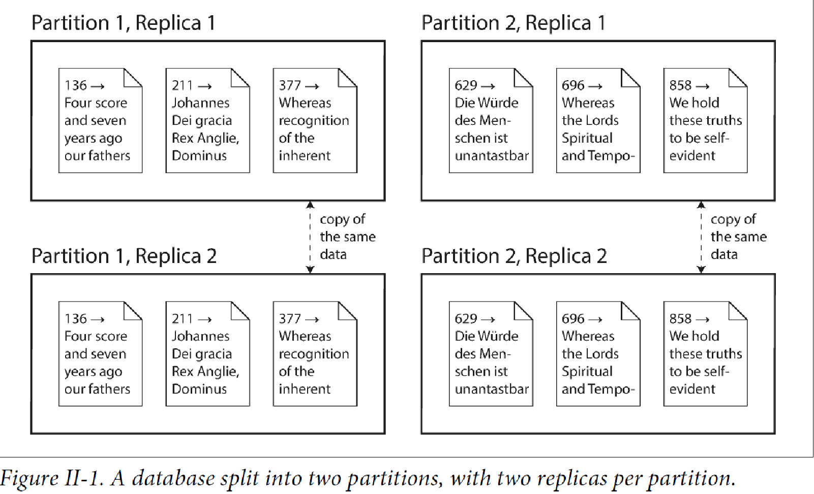

* Distribute data across multiple machines because
** scalability
. If your data volume, read load or write load grows bigger than
a single machine.
** fault tolerance/High availability
. If your application needs to continue working even if one machine goes down.
** latency
. If you have users around the world, you might want to have servers at
various locations worldwide, so that the user can be served from a datacentre
that is close to them.
* There are two common ways data is distributed across multiple nodes -
. Replication
. Partitioning

=== **Replication**
include::replication.adoc[]

=== **Partitioning AKA Sharding**
include::partitioning.adoc[]
//include::interesting_use_case.adoc[]

include::transactions.adoc[]