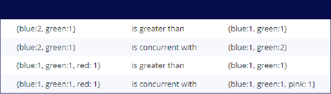
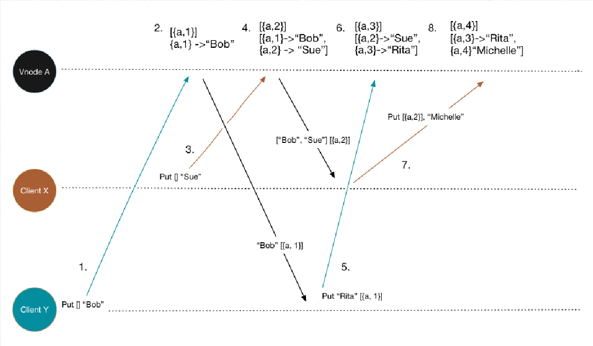

#### Leaderless replication
** Client send #writes to several replicas#.
** #Reads from several replicas# and uses version number to decide tha newest data.
** So how does data get copied to every replica like when a node is down or hasn't been updated.
. _Read repair_ - client #reads# from #several nodes# and based on the #version# decide the latest data. Also #updates# the data in the #stale node#. Only those data that is read is updated.
. _Anti-entropy_ - background process that looks for differences in the data between replicas, however this doesn't copy in a particular order and there may be delays.

** Quorums for reading and writing - _n_ replicas, every write must confirmed by atleast _w_ nodes, and we must query at least _r_ nodes for each read. So _w + r > n_. Common to make n as odd number and set _w = r = (n + 1)/2_
. n = 3, w = 2, r = 2, we can tolerate 1 unavailable node.
. n = 5, w = 3, r = 3, we can tolerate 2 unavailable node.
. Since _r_ and _w_ are configurable, lower value of _r_ and _w_ might give you a stale record but it #increases latency and availability#
*** Problems with quorum
.. write and read happens at the same time, and the write hasn't been propagated to all the required replicas, so read may return old values.
.. If a write reported as failed, as it couldn't be succeeded in _w_ replicas, however it wasn't rolled back where it succeeded. So a read might return value from that write.
.. If a node carrying the new value failed and it is replaced by a replica having old value, the quorum fails as number falls below _w_

** _Sloppy quorum_ : basically you use one of the node temporarily that is outside _n_ to write the data when something like network interruption happens. This just increases durability, however there is no guarantee of read from _r_ nodes until #hinted handoff# has completed. Hinted handoff is nothing but the transfer of data and write request from the one node that was temporarily used to accept data to appropriate home.

** _Version vectors_ : Problem is when you have leaderless replication and the same key is updated, it is important to detect concurrent update. Use #version vectors# helps detect cocurrent updates and overwrites.
. Version vector is a set of counters for each node.
. Each time a node has an internal update, it updates its own counter.
. Typical version vector
[source, java]
class VersionVector {
  private final TreeMap<String, Long> versions;
  public VersionVector() {
      this(new TreeMap<>());
  }
  public VersionVector(TreeMap<String, Long> versions) {
      this.versions = versions;
  }
  public VersionVector increment(String nodeId) {
      TreeMap<String, Long> versions = new TreeMap<>();
      versions.putAll(this.versions);
      Long version = versions.get(nodeId);
      if(version == null) {
          version = 1L;
      } else {
          version = version + 1L;
      }
      versions.put(nodeId, version);
      return new VersionVector(versions);
  }
. Typical value stored on the server with version vector
[source, java]
public class VersionedValue {
      String value;
      VersionVector versionVector;
      public VersionedValue(String value, VersionVector versionVector) {
          this.value = value;
          this.versionVector = versionVector;
      }
. Version vectors are compared to find if they are concurrent or causual.
Higher:: A version vector is higher than the other if both have the version vectors of same cluster nodes and each is higher than the other.
Concurrent:: If neither has all of the version number higher or if they have different version number for different cluster, they are concurrent
+

. Sample example of how it decides concurrent and causual writes.
+

Step 1:: Client Y puts Bob value with no context. Basically 1st write.
Step 2:: Node responds back with value and the version vector it has i.e "Bob" [{a, 1}]
Step 3:: Unaware of the activities done by Client Y, Client X also puts a value Sue.
Step 4:: Node store this value as version 2 and responds with version vector as "Bob Sue" [{a, 2}]
Step 5:: Client Y then wants to update the value, so it sends the request PUT "Rita", [{a, 1}], as this was the version vector it had from step 2 before step 3 and 4 were executed.
Step 6:: Node can now identify that the request from the step 5 is to update the value which was stored with version 1, hence is update tha value i.e "Sue Rita" [{a, 3}]
Conclusion:: Hence multiple siblings could be created based on the number of clients accessing the same key at the same time. However, dotted version vector is able to solve this by storing version vectors along with values.

