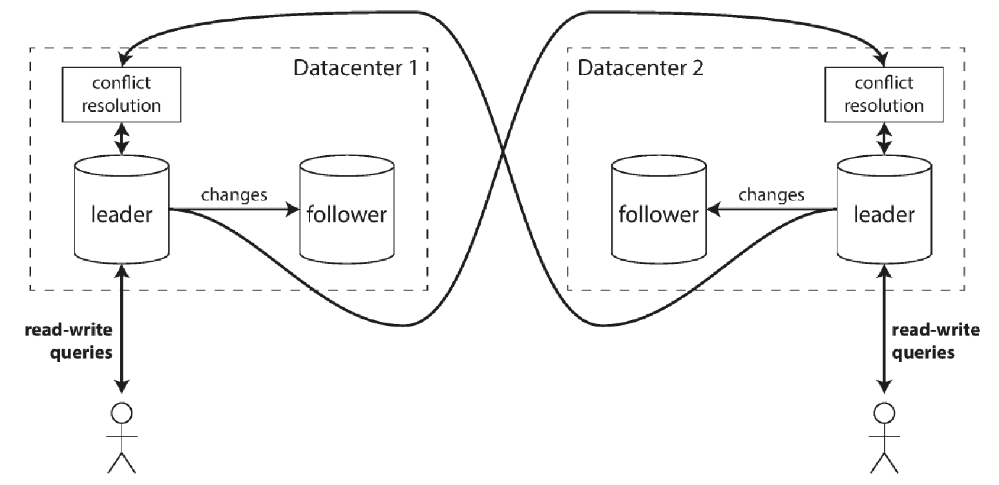
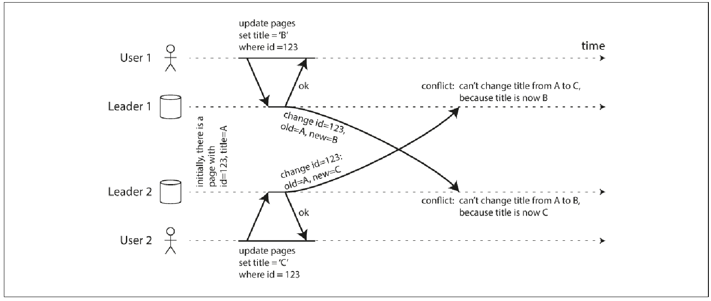

#### Multi leader replication
** Downside of leader based replication every write needs to go through single leader. If you #can't connect# to the leader, you #can't write# to the database. So when we want to #allow more than one node to accept the writes#, we need #multi leader replication#. In this each #leader acts as a follower to other leaders#.
** Downside is #resolving write conflicts#.

** Use cases -
*** _##Multi datacenter operation##_ - because you need less latency and tolerate failure.
1. So each datacenter has a leader and within datacenter normal follower replication is used.
2. Between datacenters leader replicates its changes to other leader in other datacenters.
+

+
.Performance single-leader vs multi-leader
|===
|Performance metric | Single-leader | Multi-leader

|Latency
|Significant latency as all write must go through the leader.
|Better as the writes can go through leader closest to the user.

|Reliability
|If the datacenter goes down, so does the application.
|Each datacenter can operate independently.

|Network problems
|Very sensitive to problems.
|Can tolerate temporary network interruptions.
|===
*** _##Clients with offline operation##_ - continue work while offline like calendar app
- Here each #client device is a datacenter# with its local copy of the data.

*** _##Collaborative editing##_ - several people to edit a document simultaneously.
- Each user's copy is a local replica which is asynchronously replicated to other users and server.

** _##Handling write conflicts##_

.Conflict caused by two leaders concurrently updating the same record.

*** Conflict avoidance -
. Each #document user# is assigned to a #nearest datacenter#.
. #Problem# arises when the #user changes location# or the #datacenter# the user was connected to is #dies#.
*** Converging towards a consistent state -
. If leader 1 is at x1 and leader 2 at x2, then it is not acceptable. The database must resolve the conflict in a convergent way, meaning all replicas must arrive at the same final value. Ways to achieve this is -
.. Give #each write a unique ID#, and pick the write with the highest ID. Dangerous as prone to data loss.
.. Give #each replica a unique ID#, and a higher number replica take precedence, again prone to loss.
.. Somehow #merge value# together like order them alphabetically and then concatenate them
.. Use an #explicit data structure# that saves all information, and write #application# code that #resolves the conflict#.