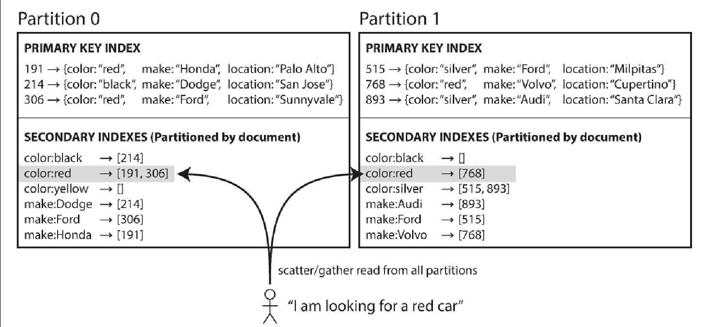
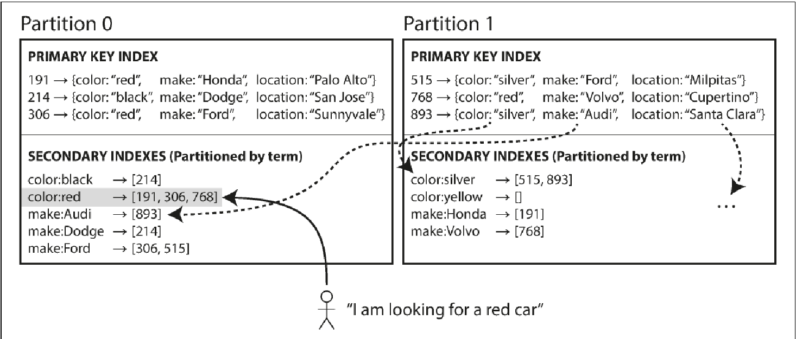

. Breaking of large database down into smaller ones for scalability.
. Spread the data and query load evenly across nodes, so in theory 10 nodes should be able to handle 10 times as much data and 10 times read and write throughput.
. #Skewed partition#  Some partitions have mode data and queries.
. #Hot spot# - A partition with disproportionately high load.
.. Simple solution for hot spots -
Solution:: Assign records to nodes randomly.
Problem:: You can't know which record went to which node and hence you have to query all partitions.

. Types of partitioning
.. _By key range_-
Pros::
... Assign continuous range of keys to each partition.
... Within each partition keep the #keys in sorted order# so that #range scans are easy# and keys can be treated as concatenated index to fetch several related records.
Cons::
... Certain access patterns can lead to hot spots.

Used in:: Bigtable, HBase, RethinkDB and MongoDB before version 2.4

.. _By hash of key_ -
Rather than assigning keys to partition, you assign #range of hashes to a partition#.
Pros::
... #Partition# boundaries are #evenly spaced#.

Cons::
... #Key range search# is #not possible# as keys are distributed based on hash. Any key range search needs to send to all partitions.
... Reduces hotspots but to an extent. In case of social site, where a celebrity has millions of users, an activity can cause this kind of hot spots problems. A solution to this problem-
.... Use compound partition key with one part and userId and second part a random number between 1-n nodes. So now the hot key is partitioned between n nodes. The problem with this is, for reads you need to repeat it n times for all the partitions. Also, this doesn't need to be done for all user, hence you need to know which keys are being split/appended.

.. _Using compound primary key_ -
Only the first part of the key is partitioned, and other are used as concatenated index for storing data.

Pros::
... If you provide #fixed# value of the #first column#, then #efficient range scans# can be done for #rest columns#.
Cons::
... Range search is still not possible for first column.
Usage::
... Efficient data models for one-to-many relationship. eg One user post many updates. If you choose primary key as (user_id, update_timestamp), then within user updates are stored ordered by timestamp.

. _Secondary indexes_ -
.. These can't identify a record uniquely but are rather #used searching occurrences of a particular value#. eg. #All cars whose color is red#, all actions by user 123 etc.
.. These indexes #cannot be mapped neatly into partitions# as we have seen that the partition is done using primary key.

Document partitioned index AKA #local index#::
... Assume you have partitioned the document by document ID eg 0-499 to partition A, 500-999 to partition B etc. Now you decide to have secondary index by color and make. So when you add a new document, database automatically it to the index.
+

+
The problem is this only adds the document which are in its partition, doesn't care if there are other partitions. As you can see that in the above diagram, both the partition 0 and 1 have individual(local) color:red index.
Reading from document partitioned indexes::
... As these indexes are local to its partition, you need to #query all the partitions and combine the results# AKA #scatter/gather# which is quite expensive.
... Used by MongoDB, Cassandra, Elastisearch, Solr

Term partitioned index AKA #global index#::
... So in this not all the indexes are stored in a singe node as this would also create bottleneck. In this even the secondary index is partitioned like color a-r is stored in partition 0 and s-z appear in partition 1.
+

... So the secondary can be partitioned using key(used for range scan i.e on a numeric property) or hash of the key for more even distribution.

... Advantage is you #don't need scatter/gather#.
... Disadvantage is #writes becomes slower# as a single write could affect multiple partitions.

. _Rebalancing partitions_
.. Basically #movement of data and request to a new node# because of -
... You want to #increase throughput#, hence you decided to add a new node.
... You #datasize has increased# and you want to add more ram hard disk.
... Your #node dies# and you need to add a new node.

.. Requirement of rebalancing -
... After load balancing, the load should be shared #fairly distributed between the nodes#.
... While this happens, #read and write should happen as usual#.
... #Least amount of data# as required should be moved to #reduce disk IO and network load#.

.. Strategies of rebalancing -

Hash mod n::
... Calculate the hash of the key and assign it to a partition using formula #hash(key) % n#
... Problem - If the number of nodes changes most of the keys needs to moved e.g Suppose hash(key) = 15 and no. of nodes = 10 before rebalancing. So the partition for key is 15 % 10 = 5. Now if you increase the node to 11 partition changes to 15 % 11 = 4, now if you increase it again 15 % 12 = 3. This frequent change is very expensive.

Fixed number of partition::
... Fix a large number of partitions and assign those partitions to each node at the outset.
... So when the balancing happens, #number of partitions do not change# nor does the assignment of keys to partition. Only the assignment of partition to nodes.
... Problem -
.... Fixing a number is difficult. If a #large number# is chosen at the outset #rebalancing on node failures is expensive# and if a #small number# is chosen they have #too much overhead#.
... Size of partition adapts to volume of the data.

Dynamic partition::
... When a #partition grows beyond the configured size#, it is split into #2 half# and the data is tranferred into another node.
... Advantage is #number of partition adapts to volume of the data#.
... Problem -
.... All the request are catered by a single node until the partition is split.
... So MongoDB, HBase allow initial number of partition to start on empty database AKA pre-splitting.

Partitioning proportional to nodes::
... Number of partitions proportional to nodes i.e fixed number of partition per node.
... Size of each partition ~ size of dataset when the number of nodes is fixed.
... When the number of nodes increases, the size of the partition decreases. Newly added node selects a fixed number of partition to split and then takes ownership of it.
... Used by Cassandra.

.. _Request routing_
... When the rebalancing happens, requests needs to be routed to the newly added nodes. Below are the approaches -
.... #Client contacts a node# through load balancer, if the node has that partition it responds, else that node redirects the request to appropriate node and forwards the response from that node.
.... Send all requests from clients to routing tier, which is #partition aware load balancer#.
.... #Client are aware of the partitioning# and send the request directly to that partition.

... Problem is whether it is a client or a load balancer, how will they know the changes in assignment to the partition?
... Solution use Zookeeper as done by HBase, Solr, Kafka. MongoDB uses similar architecture using custom implementation. Cassandra and Riak uses gossip protocol, where in a request is routed to any node and that forwards them to appropriate nodes.

