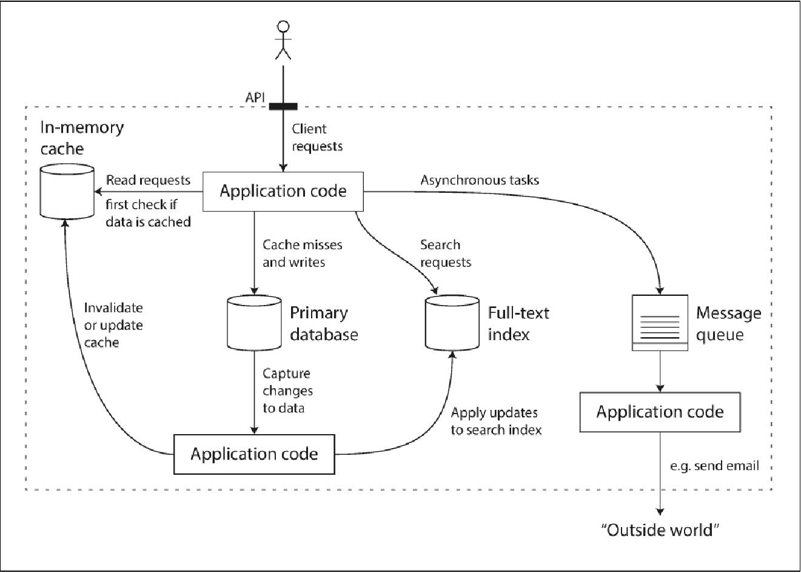

* Few things that can come into questions while designing -
. How do
you ensure that the data remains correct and complete, even when things go wrong
internally?
. How do you provide consistently good performance to clients, even when
parts of your system are degraded?
. How do you scale to handle an increase in load?
. What does a good API for the service look like?

* Three things that we should focus -
. **Reliability** - The system should continue to work correctly (performing the correct function at
the desired level of performance) even in the face of adversity (hardware or software
faults, and even human error).
. **Scalability** - As the system grows (in data volume, traffic volume, or complexity), there should
be reasonable ways of dealing with that growth.
. **Maintainability** - Over time, different people will work on the system (engineering and operations,
both maintaining current behavior and adapting the system to new use
cases), and they should all be able to work on it productively.

#### Reliability
. Application performs the function that the user expected.
. It can #tolerate user making mistakes# or using the software in unexpected ways.
. The #performance is good# enough under the expected load and data volume.
. The system #prevents any unauthorized access# or abuse.

##### What is fault and failure?
Things that can go wrong are _faults_ where in one component of the system deviates from its spec.
_failure_ is when system as a whole stops providing the required service to the user.

##### Hardware faults
Add redundancy individual hardware components like
1. Disks may be setup in RAID.
2. Dual power supply for servers.
3. hot-swappable CPUs.
4. Battery and diesel generators in data centers.

##### Softwares faults
. Hard to correlate across nodes.
. Code may lie dormant for a long time untill triggered by unsual set of circumstances.

##### Human errors
. Humans are known to be unreliable.
. Design system that minimizes opportunity for error.
.. Abstractions and API and admin interface make it easy to the right things,
however if the interfaces are too restrictive, people will workaround them nagating their benefit.
. Decouple places where they can make mistakes from the places that can cause failures e.g sandbox environment
. Tests
. Allow quick and easy recovery from human errors.
. Set up detailed and clear monitoring.

#### Scalability
. Systems abnility to cope with increased load.
. What is the difference between latency and response time?
.. Response time is what the client sees which includes time to process, network delays and queuing delays.
.. Latency time is when request is waiting to be handled or awaiting service.

