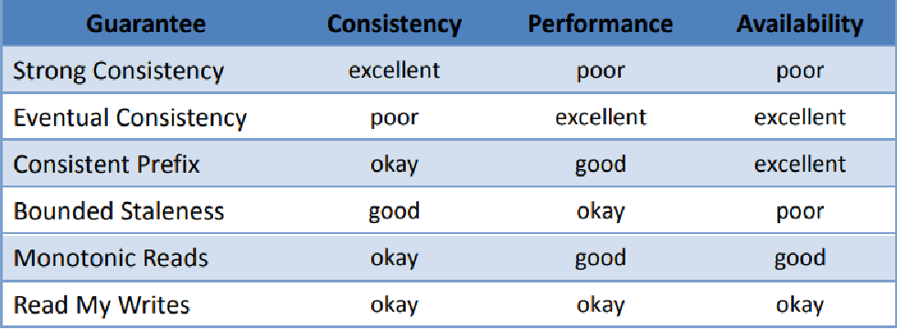

** Replication means keeping a copy of the same data on
multiple machines that are connected via a network.
. Why would you want to replicate data?
.. To keep data geographically close to your users.
.. To allow the system to continue working even if some of its parts have failed.
.. To scale out the number of machines that ca serve read queries.

** If the data that needs to be migrated doesn't change, then easy to replicate as the data can be easily copied.

** Challenges arrive when the data being replicated changes.

** What is a replica?
.. Each node that stores a copy of the database is called a __replica__.
.. Each write to a database needs to be processed by every replica. The most common
solution for this is called __leader-based-replication__.
+

There are three algorithm for replicating changes between the nodes -

. single leader
. multi leader
. leaderless

include::single-leader-replication.adoc[]
include::multi-leader-replication.adoc[]
include::leaderless-replication.adoc[]

** Comparing guarantee with CAP

.Read guarantee with CAP
