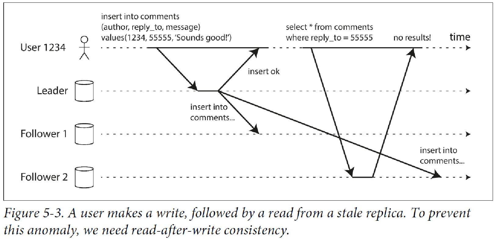

#### Single leader replication
** Each node stores a copy of the data, called as replica.

** How to ensure all the data ends up in all the replicas?
- Leader-based/active-passive/master-slave replication.
- One replica designated as a leader. When client want to write, they must send request to the leader.
- Whenever leader writes new data, it also sends that data to all the replicas and all the replicas update their local storage.

** How does data replication happen?
- *synchronous* - #leader waits# till the #follower confirms# that it has received the writes and then send the response back to client.
*** Advantages -
1. followers always up to date with leader.
2. if the leader dies, data is still available in followers.
*** Disadvantage -
. if the follower doesn't respond, write cannot be processed.
. Latency increases with number of followers.
- *asynchronous* - leader sends the message to client and doesn't wait for follower.
*** Advantages -
1. leader continues to write even if all the followers are dead.
*** Disadvantage -
1. if leader dies, any write that is not replicated is lost.

- *semi-synchronous* - Not all the followers are synchronous. Atleast one is synchronous.
*** Advantages -
1. This guarantees that you have an up-to-date copy of the data on at least two nodes:
the leader and one synchronous follower.
2. If the synchronous follower becomes unavailable or slow, one of the asynchronous followers is made synchronous

** Databases that use this -
*** Relational database - PostgreSQL, MySQL,
*** Non-relational database - MongoDB, RethinkDB
*** Message brokers - Kafka, RabbitMQ

** __Setting up new follower__
1. Take a #snapshot# of the leader database at some #point in time#.
2. #copy the snapshot# to the new follower.
3. The #follower# then connect to the leader, to take all the #delta changes# that has happened since the snapshot.
So the snapshot is associated with an exact position in the log, known as #log sequence number#.
4. When the follower has processed all changes in the data, it is said to be caught up. It can then process data as they happen in leader.

** Systems can go down, so how to we achieve high availability in leader based replication?
1. _Follower failure - catch-up recovery_
*** Since each follower keeps the log of data changes that it has received from leader,
If it crashes, or is restarted or the network between leader and follower is temporarily disconnected, the follower can
recover quickly from its log.
*** If there is some network issue, the follower can connect with leader to find all the data changes that happened
since it was done and can do the catch-up.
2. _Leader failover - Failover_
*** Determining that the leader is dead - Use timeout, if a node doesn’t respond for some period of time—say,
30 seconds—it is assumed to be dead.
*** Choosing a new leader - Gettin all nodes to agree on a leader using consensus.
*** Reconfiguring the system to use a new leader.
*** Clients needs to be reconfigured to send their writes to a new leader.

**** Problems with this kind of failover -
a. if async is used, new leader might not have all the writes from the old leader that died.
If the former leader joins, what should happen to those writes? One option is to discard the data which may violate the client durability expectations.
Also if the data is being share with outside storage systems. Refer to incident at github.
b. It could happen that 2 nodes both believe that they are the leaders and if both accept writes, data is likely to be lost of corrupted.
c. What is the right timeout before declaring a leader as dead? Longer time means longer time to recovery and shorter time could lead to unnecessary failovers.
** _Implementation of replication log_
1. #Statement based replication# - every #crud operation# is #forwarded# to its followers.
*** Problems -
a. #non-deterministic function# may generate different value on each replica.
b. if #auto incrementing sequence# is being used, they need to implemented in the same order.
c. Statements that have side effect like #triggers, functions, stored-procedure# calls may result in different side effects on each replica.
2. #Write ahead log(WAL)# shipping - #append only logs# which the leader can send to its followers. #Followers# then can use the #log to rebuild#. Used in #Oracle# and #PostgreSQL#.
*** Problem -
a. Details are of very low level. If the database #changes its storage format# from one version to another, it is not possible to different versions of the database software on both leader and follower. You need then downtime to do such upgrades.
3. _Logical( row based replication)_ - MySQL bin log. this uses #different log format# for storage and replication,
hence it is now #decoupled from storage engine# internals.
It basically is sequence of records describing writes to database at row level.
*** Advantages -
a. Leader and follower can #run different versions# of the database software or storage engines.
b. It is easier for an #external application for parse# the data like data-warehouse.

4. _Trigger based replication_- Oracle golden gate. Custom #application code# that is #automatically executed#
when the data changes. It has greater overhead but is nevertheless useful due to flexibility.
** _Problems of replication logs_ -
***  #Read scaling# architecture where in you can #increase the read capacity# for serving read-only requests
simply by #adding more followers#. If you tried this with #sync replicate#, a #single node failure# can bring
the whole #system down#. And the #more followers# you have the #likelihood# of that increases.

*** If used in #async# way, #outdated information# might still be available in follower as the follower still hasn't caught up with the leader.
However this is temporary state hence it known as #eventual consistency#.
So this time which the follower take to catch up with the leader is replication lag.
*** Problems that are likely to occur when there is replication lag and
some approaches to solving them.
**** #Reading your own write# -
+

AKA #read-after-write# consistency.
It is a #guarantee# that the #user# will #always# see #updates# they #submitted themselves#. Ways to achieve this -
1. If a small section of the application is editable by the user, #update by the users can be served by the leader#.
2. If a big section is editable by the user, reading every user's update from the leader will negate the benefits of read scaling.
Here you can define a time, lets say #1 min till which leader will serve those request and then followers will take up#.
You also then need to monitor the replication lag of followers to route request only to those followers within 1 min.
3. Client can remember the timestamp of the most recent write, then the system can ensure that the replicas that are serving
the read requests reflect updates atleast untill that timestamp. This fails when the user tries to access from different devices.
Then the last update metadata needs to be centralized.
4. When the application is having #multiple datacenters#, then request needs to #routed to the datacenter that has the leader#.

**** #Monotonic reads# -
+

lesser guarantee than strong consistency but stronger guarantee than eventual consistency.
This means that if a user makes #several read requests# in sequence like in #page refresh#,
they will #not read older data after having previously read newer data#. Ways to achieve this -
1. User always makes the read from the same replica which can be done using hashing,
If the replica dies, queries need to routed to another replica.

**** #Consitent prefix reads# - Gaurantees that if a sequence of writes happens in a certain order,
then anyone reading those writes will see them appear in the same order.
1. One solution is to make sure that any writes that are causally related to each other are
written to the same partition—but in some applications that cannot be done efficiently.

