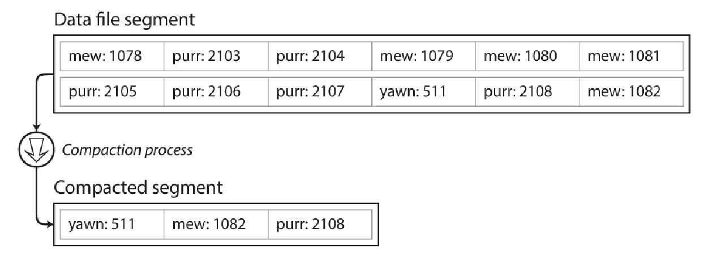
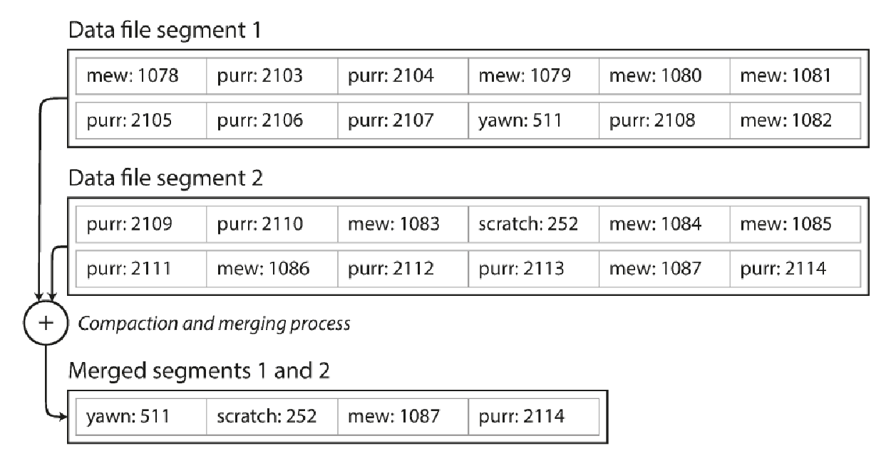
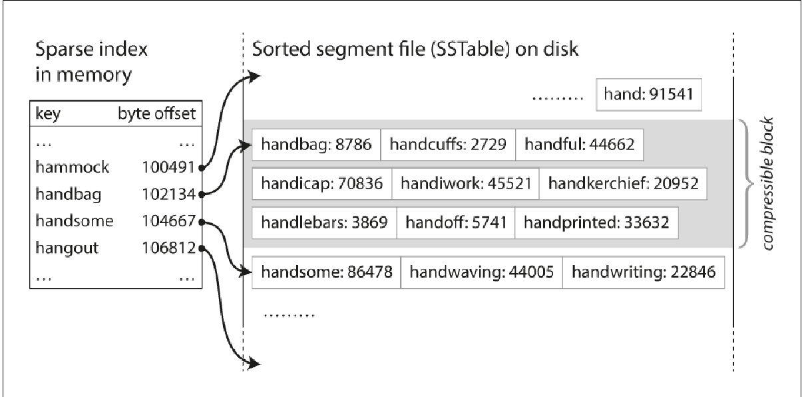
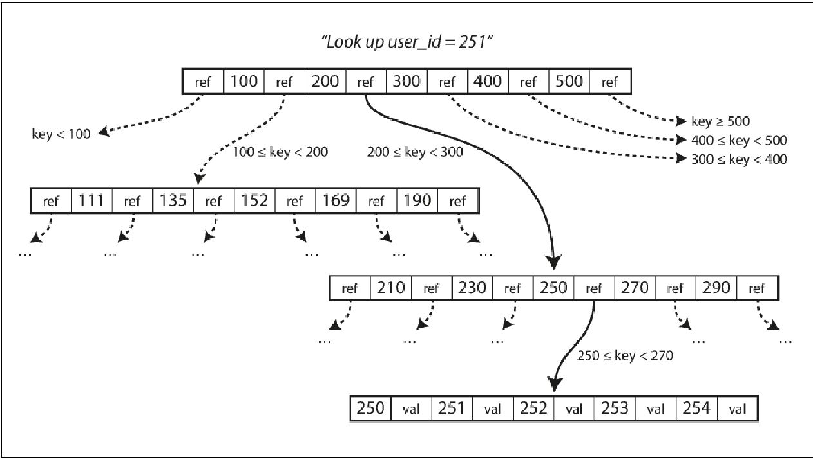
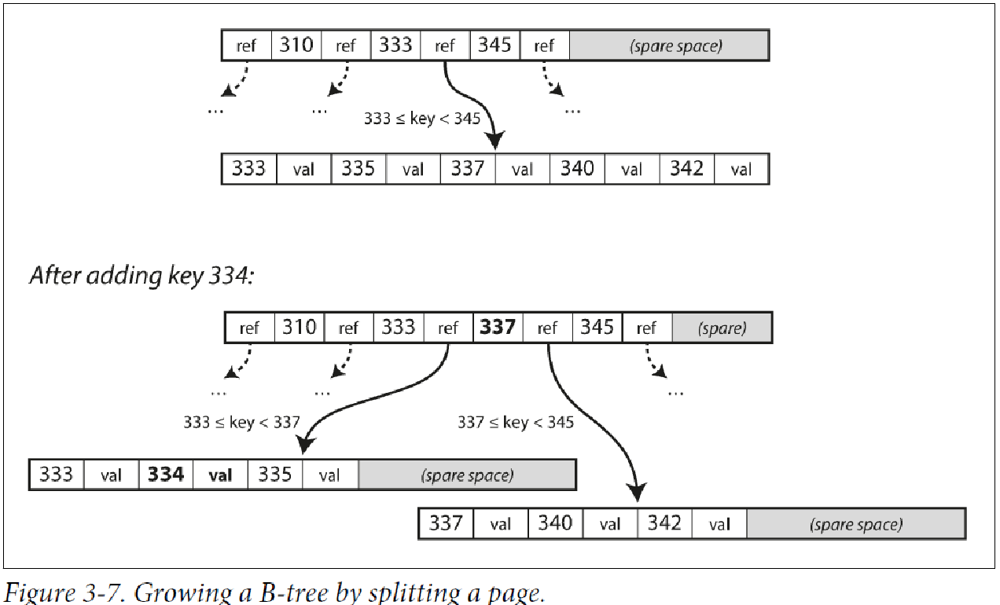
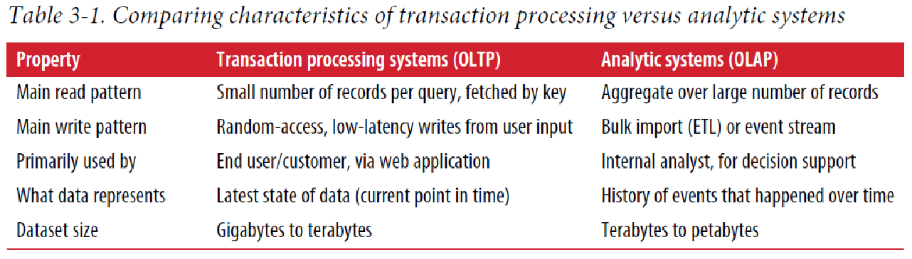
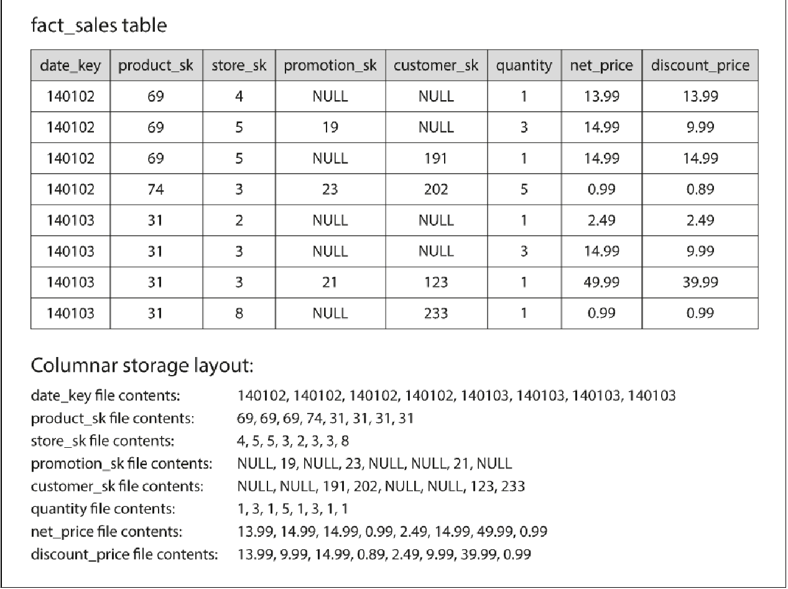

==== Storage and retrieval
. At most fundamental level, a database needs to do two things
.. When you give it some data, it should store the data
.. When you ask it again later, it should give the data back to you.

. Why should you as an application developer care how the database handles storage and retrieval internally?
.. You need to select a storage engine that is appropriate for your application.
.. To tune a storage engine to perform well on your kind of workload.

. Consider the world’s simplest database, implemented as two Bash functions:
[source, bash]
#!/bin/bash
db_set () {
echo "$1,$2" >> database
}
db_get () {
grep "^$1," database | sed -e "s/^$1,//" | tail -n 1
}

. The above database has the best performance on write but terrible performance in read.
.. **Indexes**
... Additional metadata on the side, which acts as a signpost and helps you to locate the data.
... This is derived from the primary data.
... Any index will slow down the writes because the index also needs to be updated every time
data is written. So they speed up reads but slow down writes.
. Many databases internally use a __log__ which is append only data file.
.. How do we avoid running out of disk space?
... Break the file into segments when it reaches certain size limit.
... Perform compaction - meaning throwing away duplicates and keeping only the most recent
updates.
+

... Since compaction makes the segment smaller, we can merge compacted segments.
... The merging and compaction of frozen segments
can be done in a background thread
+

.. Some of the issues that are important in real implementations
... Deleting records
.... You have to append a special deletion record to the data file
sometimes called as tombstone. These tombstones tell the merging process to discard
any values of the deleted key.
... Crash recovery
.... In memory  hash maps are lost when the database is restarted. You could read the segment
file and create the hashmap again but this is a costly operation.
... Partially written records
.... The database may crash any time including halfway through appending a records to the log.
... Concurrency control
.... As writes are appended to the log in a strictly sequential order, its common to have single writer thread.

.. Append only design is good because-
... Appending and segment merging are sequential write operations which is much faster the random writes.
... Concurrency and crash recovery are much simpler if segment files are append only.
.. Limitations of append only design -
... The hash table must fit in memory.
... Range queries are not efficient e.g you cannot scan over all keys between 0000 and
9999.

. SS tables
.. While creating segments, we sort the keys. Hence called **sorted string table**.
.. Advantages of SStable
... Merging is simple as merging is similar to merge sort.
... In order to find a key, you don't need index of all the keys in memory. You keep some
of the indexes in memory(**sparx index**) and then you can use that to check where to find the key.
+

... You can group the records into blocks and compress it. Each entry in the sparx index
then points to the start of a compressed block. Saves disk and I/O.
.. Constructing and maintaining SSTable
... When the data comes in you write to in-memory BST (red-black or AVL) sometimes called
__memtable__.
... When memtable gets bigger, you write the data to a SSTable segment. SSTable becomes
the most recent data segment. Also when SSTable is being written to disk,
writes can continue to a new memtable instance.
... For read request, find the key in memtable, then most recent disk, then next and so on.
... In the background, run merging and compaction process to combine segment files and
discard overwritten or deleted values.
.. Problem with this approach is -
... When the system crashes, most recent writes that were in the memtable is lost.
.... This can be solved by keeping a separate log in the disk to which every write is immediately
appended. The purpose of this log is to restore memtable in case of crash.
... When looking up for keys that do not exist, then the segments all the way back to the
oldest needs to scanned to check if the key exists.
.... Solution is to use Bloom filters, which are memory efficient data structures for
approximating the contents of the set.
. LSM trees from SSTable
.. keeping a cascade of SSTables that are merged in the background—is simple and effective.
.. Even when the dataset is much bigger than the available memory it continues to work well.
.. Since data is stored in sorted order, you can efficiently perform range queries (scanning
all keys above some minimum and up to some maximum).
.. The disk writes are sequential the LSM-tree can support remarkably high write throughput.

. B-Trees
.. While LSM creates variable size segment, b-tree uses fixed size blocks and read or write one
page at a time. The design is similar to the underlying hardware as disks are also arranged
in fixed size blocks.
.. Each page contains several keys and reference to child pages.
+

.. Addition of new key
+

.. Making B-tree resilient
... Since B-trees overwrite pages on a disk, and when pages are split, chances are that the
system crashes before all the split pages are written to the disk. So you might end up in
corrupted state.
... In order to avoid the corrupted state, B-tree uses additional data structure on disk,
a __write ahead log (WAL)__ or __redo log__.
... This WAL is append only log, which every B-tree has to write to before writing data to
disk. So when DB comes up after a crash, B-tree can be restored.
.. Concurrency control
... When multiple threads are accessing the tree at the same time, a thread may see the tree
in an inconsistent state. This is done by protecting tree data structure with latches.
... Use copy-on-write scheme, a modified page is written to a new location, and the parent is
updated with the new location.

.B-tree vs LSM
|===
|LSM tree | B-tree

| LSM writes are faster because of sequential write | Writes are bit slow.
| Reads are slow as several  data structures need to be checked | Reads are fast.
| Lower write amplification i.e one write in database results in multiple writes
to the disks. | Atleast 2 once is WAL and once in page and again is the page is split.
| High throughput because of lower write amplification and sequential writes | Low
| Lower storage overhead and merging and compaction are periodically done | Some disk space
is unused due to fragmentation.
| Compaction can sometimes interfere of ongoing read and writes. At higher percentiles,
the response time is quite high | They are more predictable response time and consistently
good performance.
| In case of high throughput if compaction is configured correctly, it can happen that the
compaction cannot keep up with the rate of incoming writes. So number of unmerged segments
keeps on growing, slowing down reads | Not as issue as compaction is not done.
| There can be multiple copies of the same key in different segments. | Each key exists
exactly in one place in the index, hence offer strong transactional isolation.
|===

. In-memory databases
.. Mostly used for caching.
.. Some aim for durability. How can you increase durability of in-memory cache?
... Special hardware such as battery powered RAM.
... Writing a log changes to disk.
... Writing periodic snapshot to disk.
... Replicating in-memory state to other machines.

. Transaction processing
+

. Columnar storage
+
