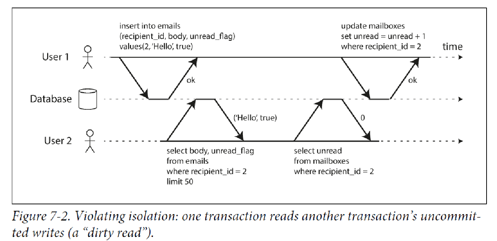
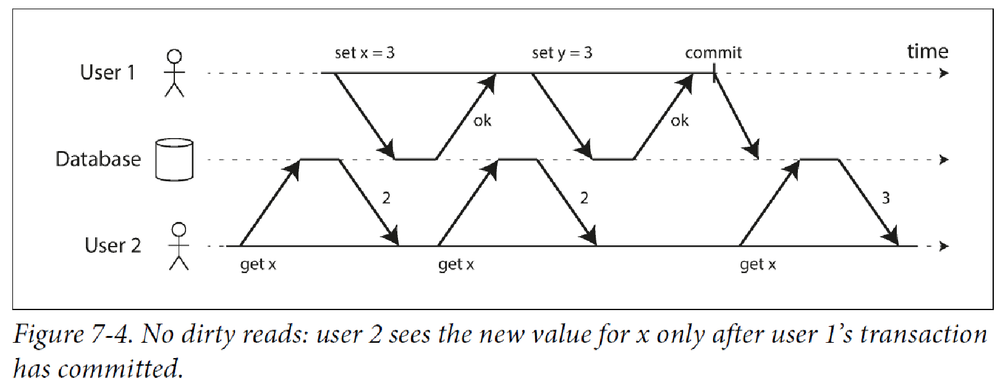
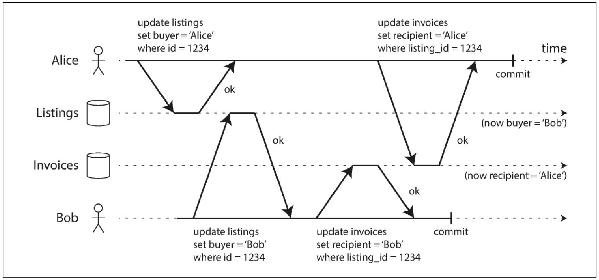
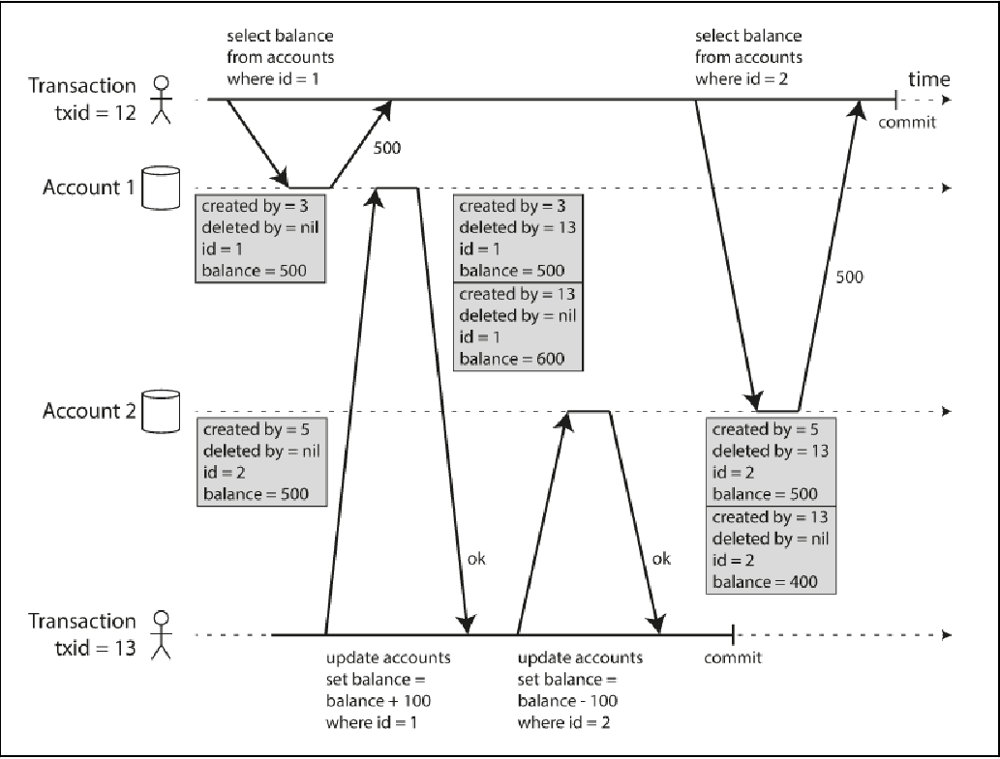
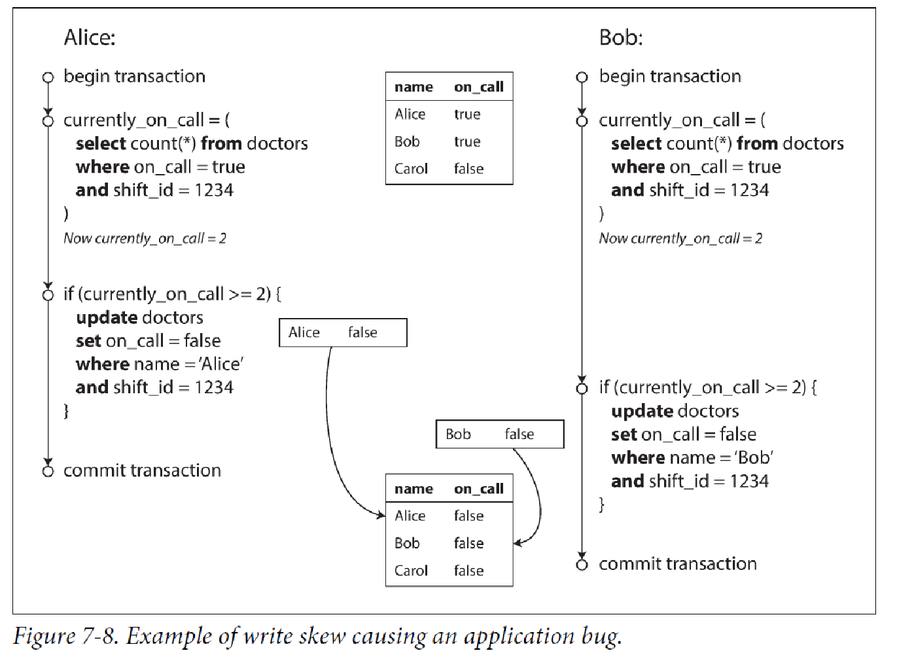

=== **Transactions**
. This is a way to #group several reads and writes together# into a logical unit,
so that ##either the transactions succeeds or fails##. If it fails, then the application can retry.
. [.blue]#Why do we need transactions?#
.. Database hardware of software may fail anytime.
.. The application may crash at any time.
.. Interruptions is database can unexpectedly cut off the application from the database.
.. Concurrent writes might overwrite the changes.
.. Client may read stale data.
.. Race condition between clients.

. [.blue]#Guarantee that a transaction can provide# - ACID
Atomicity:: The ability to #abort a transaction on error# and have all the writes from
the transaction discarded, so that the application can be sure that it didn't change anything.

Consistency:: At the end of the transaction, #all the invariants must hold true#. Only some
invariants can be checked like uniqueness and foreign keys. Its the application's
responsibility to which invariants should hold true.

Isolation:: #Concurrently executing transactions are isolated# from each other. Each transaction can
pretend that it is the only transaction running on the entire database. The database
ensures that when the transactions have committed, the result is the same as if they
had run serially (one after another), even though in reality they may have run concurrently
if one transaction makes several writes, then another transaction should
see either all or none of those writes, but not some subset

Durability:: When one #transaction is successfully committed#, any #data# it has written will
be there even in case of hardware failure or database crash.

. [.blue]#Single object and multi object write#.
+

Single object:: Single row or document. Databases always provide atomicity and isolation on the level of single object.
.. Atomicity can be implemented using log for crash recovery.
.. Isolation can be implemented using lock on each object i.e allowing only one thread to access an object.

Multi object transaction:: Modify several objects like rows, documents at once.
.. How do you know which all read and writes belong to the same transaction?
... Based on TCP connection to the database. Everything between BEGIN TRANSACTION and COMMIT.
... Problem is if due to interruptions, client is has done the commit and the commit actually happened but the acknowledgement from the server is lost, then client will never know if the transaction succeeded.
.. Many distributed data stores have completely abandoned multi object transaction due to the complexity it adds.
... In relational model, foreign keys are used pointing to another row in another table. Multi object transaction allows that these reference rename the valid.
... Document databases since lack join functionality, support de-normalisation. So you might have to update several documents in one go. Transactions help in this.
... Secondary indexes also needs to be updated every time you do an update.

Handling errors and aborts:: A key functionality of ACID is a transaction can be aborted and retried if an error occurred.
Problems that needs to be handled when retrying a transaction -
.. when a transaction actually succeeded but the network failed when the server tried to communicate to the client, so the client thinks it has failed. Then retrying could cause the action to be performed again.
.. If the error is due to overload, then retying will only make the things worse.
.. We should retry permanent errors, only transient errors needs to be retried.
.. Side effects might be triggered again if the transaction is repeated.

==== Serializable isolation
.. Highest level of isolation i.e database guarantees that transactions have the same as if they were run serially.
.. Cost is performance is slow. Hence many database avoid serializable isolation.

==== Weak isolation levels
Read committed:: Used by #DB2 and SQL Server#
. No dirty read - when reading only see the data that is committed.
. No dirty write - when writing data only the data that is committed will be written.
+

. Why to use no dirty reads?
.. Seeing database in partially updated state might create confusion.
.. If the transaction is aborted, then transaction may see data that is later rolled back.

. Why to use no dirty writes?
.. Dirty writes can cause bad outcomes.
+

. How to implement read committed?
.. To prevent dirty writes use locks on the row.
.. To prevent dirty read, you can use the same lock approach,
however it will slow down the whole read and write. Hence most database keep
both the old committed value and the new value added during the transaction.
Any read call until the transaction is completed simply returns old value.

Read uncommitted::
... dirty read - when reading can see the data that is still not committed.
... No dirty write - when writing data only the data that is committed will be written.

Nonrepeatable read or read skew::
+
image::read-skew.png[]

Snapshot isolation and repeatable read:: PostgreSQL, MySQL, Oracle, SQL server.
. Each transaction reads from a consistent snapshot of the database.
Even if the data is changed by another transaction, each transaction only sees old data.

. How to implement this?
.. Maintain #several versions of an object# so that various in-progress transaction
see the state at different points in time aka #Multi version concurrency control (MVCC)#
.. Insert translated to insert.
.. Delete just marks the object for deletion which is later deleted by GC.
.. #Update translated to delete and insert.#
.. Each transaction is given a #unique transaction ID which is ever increasing#.
.. When a transaction starts database makes a list of all running transactions.
.. Any writes made by a higher transaction is not visible to lower transaction ID.
.. An object is visible when both the below conditions are true -
... At the time when the reader's transaction started, the transaction that created the
object had already completed.
... The object hasn't been marked for deletion either by a previous transaction or any
running one.
+

Indexes and snapshot isolation::
. append-only/copy-on-write variant that does not overwrite pages of the tree
when they are updated, but instead creates a new copy of each modified page
. With append-only B-trees, every write transaction (or batch of transactions) creates a
new B-tree root, and a particular root is a consistent snapshot of the database at the
point in time when it was created. There is no need to filter out objects based on
transaction IDs because subsequent writes cannot modify an existing B-tree; they can
only create new tree roots.

Preventing lost updates::
. The lost update problem can occur if an application reads some value from the database,
modifies it, and writes back the modified value (a read-modify-write cycle). If
two transactions do this concurrently, one of the modifications can be lost, because
the second write does not include the first modification
. This pattern occurs in various different
scenarios:
.. Incrementing a counter or updating an account balance (requires reading the
current value, calculating the new value, and writing back the updated value)
.. Making a local change to a complex value, e.g., adding an element to a list within
a JSON document (requires parsing the document, making the change, and writing
back the modified document)
.. Two users editing a wiki page at the same time, where each user saves their
changes by sending the entire page contents to the server, overwriting whatever
is currently in the database
. Solutions
.. __Atomic writes__ -
... Many databases provide atomic update operations, which remove the need to implement
read-modify-write cycles in application code.
+
[source, sql]
UPDATE counters SET value = value + 1 WHERE key = 'foo';

... Atomic operations are usually implemented by taking an exclusive lock on the object
when it is read so that no other transaction can read it until the update has been
applied.

.. __Explicit locking__
... Application to explicitly lock
objects that are going to be updated. Then the application can perform a readmodify-
write cycle.
+
[source, sql]
BEGIN TRANSACTION;
SELECT * FROM figures
WHERE name = 'robot' AND game_id = 222
FOR UPDATE;
UPDATE figures SET position = 'c4' WHERE id = 1234;
COMMIT;

.. __Automatically detecting lost updates__
... Allow them to execute
in parallel and, if the transaction manager detects a lost update, abort the transaction
and force it to retry its read-modify-write cycle.

.. __Compare and set__
... The purpose of this operation is to avoid lost updates by allowing an update to happen
only if the value has not changed since you last read it
+
[source, sql]
-- This may or may not be safe, depending on the database implementation
UPDATE wiki_pages SET content = 'new content'
WHERE id = 1234 AND content = 'old content';
... if the database allows the WHERE clause to read from an old snapshot,
this statement may not prevent lost updates, because the condition may be true even
though another concurrent write is occurring.

. The above techniques do not work in replicated databases as there are multiple copies of
data. The below technique can be used -
.. __ Conflict resolution and replication__
... allow concurrent writes to create several
conflicting versions of a value (also known as siblings), and to use application code or
special data structures to resolve and merge these versions after the fact.

Write Skew and Phantoms::
. __Write skew__
+

.. Neither dirty write nor a lost update because of updating different
objects but still some invariants are violated.
.. Write skew can occur if two transactions read the same objects, and then update some of
those objects (different transactions may update different objects).
.. Atomic writes won't help and multiple objects are involved.
.. Automatic detection of lost updates also doesn't help.
.. Can only use __explicit locks__
+
[source, sql]
BEGIN TRANSACTION;
SELECT * FROM doctors
WHERE on_call = true
AND shift_id = 1234 FOR UPDATE;
UPDATE doctors
SET on_call = false
WHERE name = 'Alice'
AND shift_id = 1234;
COMMIT;

.. Same problem when booking meeting room, though not safe under __snapshot isolation__
+
[source, sql]
BEGIN TRANSACTION;
-- Check for any existing bookings that overlap with the period of noon-1pm
SELECT COUNT(*) FROM bookings
WHERE room_id = 123 AND
end_time > '2015-01-01 12:00' AND start_time < '2015-01-01 13:00';
-- If the previous query returned zero:
INSERT INTO bookings
(room_id, start_time, end_time, user_id)
VALUES (123, '2015-01-01 12:00', '2015-01-01 13:00', 666);
COMMIT;

... This will not work dues to phantom effect.

.. Multiplayer game
... You can use __select for update__ along with unique constraints.
.. Username selection.
... Unique constraint is a simple solution here.
... Cannot use select for update because there is no row matching t
the criteria.
.. Preventing double spending
. __Phantom causing write skew
.. Write in one transaction changes the result of a search query in
another transaction, is called a __phantom__.
.. Mostly when the select query doesn't return a matching row  but the
insert operation add a row and if the select query is run again the result
differs.

Serializability::

