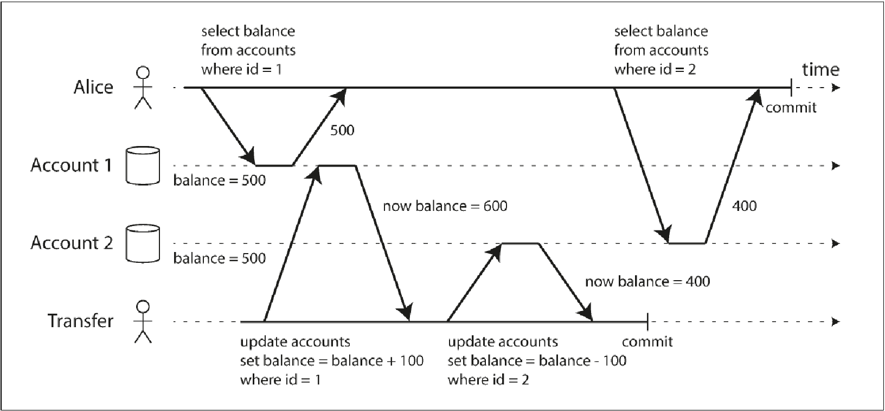

=== **Transactions**
. This is a way to #group several reads and writes together# into a logical unit, so that ##either the transactions succeeds or fails##. If it fails, then the application can retry.
. [.blue]#Why do we need transactions?#
.. Database hardware of software may fail anytime.
.. The application may crash at any time.
.. Interruptions is database can unexpectedly cut off the application from the database.
.. Concurrent writes might overwrite the changes.
.. Client may read stale data.
.. Race condition between clients.

. [.blue]#Guarantee that a transaction can provide# - ACID
Atomicity:: The ability to #abort a transaction on error# and have all the writes from the transaction discarded, so that the application can be sure that it didn't change anything.

Consistency:: At the end of the transaction, #all the invariants must hold true#. Only some invariants can be checked like uniqueness and foreign keys. Its the application's responsibility to which invariants should hold true.

Isolation:: #Concurrently executing transactions are isolated# from each other.

Durability:: When one #transaction is successfully committed#, any #data# it has written will be there even in case of hardware failure or database crash.

. [.blue]#Single object and multi object write#.
Single object:: Single row or document. Databases always provide atomicity and isolation on the level of single object.
.. Atomicity can be implemented using log for crash recovery.
.. Isolation can be implemented using lock on each object i.e allowing only one thread to access an object.

Multi object transaction:: Modify several objects like rows, documents at once.
.. How do you know which all read and writes belong to the same transaction?
... Based on TCP connection to the database. Everything between BEGIN TRANSACTION and COMMIT.
... Problem is if due to interruptions, client is has done the commit and the commit actually happened but the acknowledgement from the server is lost, then client will never know if the transaction succeeded.
.. Many distributed data stores have completely abandoned multi object transaction due to the complexity it adds.
... In relational model, foreign keys are used pointing to another row in another table. Multi object transaction allows that these reference rename the valid.
... Document databases since lack join functionality, support de-normalisation. So you might have to update several documents in one go. Transactions help in this.
... Secondary indexes also needs to be updated every time you do an update.

Handling errors and aborts:: A key functionality of ACID is a transaction can be aborted and retried if an error occurred.
Problems that needs to be handled when retrying a transaction -
.. when a transaction actually succeeded but the network failed when the server tried to communicate to the client, so the client thinks it has failed. Then retrying could cause the action to be performed again.
.. If the error is due to overload, then retying will only make the things worse.
.. We should retry permanent errors, only transient errors needs to be retried.
.. Side effects might be triggered again if the transaction is repeated.

==== Serializable isolation
.. Highest level of isolation i.e database guarantees that transactions have the same as if they were run serially.
.. Cost is performance is slow. Hence many database avoid serializable isolation.

==== Weak isolation levels
Read committed:: Used by #DB2 and SQL Server#
. No dirty read - when reading only see the data that is committed.
. No dirty write - when writing data only the data that is committed will be written.
+
image::../images/read-committed.png[]
. Why to use no dirty reads?
.. Seeing database in partially updated state might create confusion.
.. If the transaction is aborted, then transaction may see data that is later rolled back.

. Why to use no dirty writes?
.. Dirty writes can cause bad outcomes.
+
image::../images/dirty-write.png[]

. How to implement read committed?
.. To prevent dirty writes use locks on the row.
.. To prevent dirty read, you can use the same lock approach, however it will slow down the whole read and write. Hence most database keep both the old committed value and the new value added during the transaction. Any read call until the transaction is completed simply returns old value.

Read uncommitted::
... dirty read - when reading can see the data that is still not committed.
... No dirty write - when writing data only the data that is committed will be written.

Nonrepeatable read or read skew::
+

Snapshot isolation and repeatable read:: PostgreSQL, MySQL, Oracle, SQL server.
. Each transaction reads from a consistent snapshot of the database. Even if the data is changed by another transaction, each transaction only sees old data.

. How to implement this?
.. Maintain #several versions of an object# so that various in-progress transaction see the state at different points in time aka #Multi version concurrency control (MVCC)#
.. Insert translated to insert.
.. Delete just marks the object for deletion which is later deleted by GC.
.. #Update translated to delete and insert.#
.. Each transaction is given a #unique transaction ID which is ever increasing#.
.. When a transaction starts database makes a list of all running transactions.
.. Any writes made by a higher transaction is not visible to lower transaction ID.
.. An object is visible when both the below conditions are true -
... At the time when the reader's transaction started, the transaction that created the object had already completed.
... The object hasn't been marked for deletion either by a previous transaction or any running one.
+
image::mvcc.png[]

